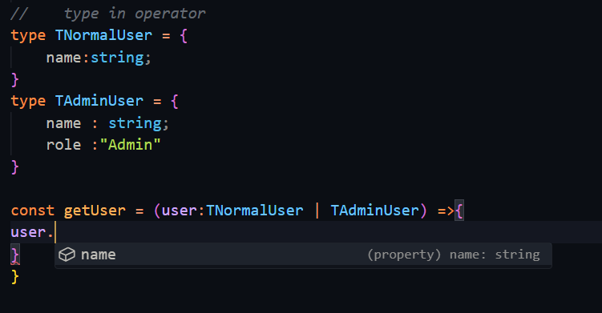
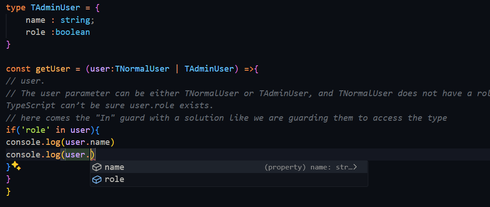
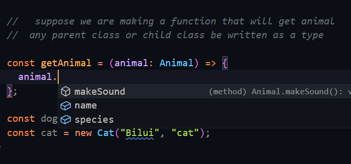
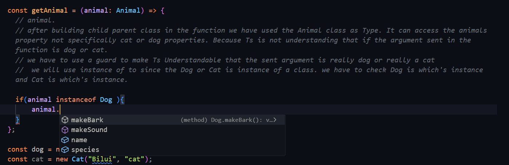

# Object Oriented Typescript

GitHub LInk: GitHub Link: https://github.com/Apollo-Level2-Web-Dev/Apollo-Level2-Web-Dev-batch-5-be-a-typescript-technocrat/tree/main/module3

Welcome back to the next step in your TypeScript journey!

In this module, you'll dive into the heart of Object-Oriented Programming (OOP). Here's what you'll explore:

Introduction of Object Oriented Programming

We will introduce you to object oriented programming. You'll learn what OOP is and how OOP principles help structure and maintain complex codebases.

Class and object

Classes serve as blueprints for creating objects, which are instances that encapsulate both state and behavior. You'll learn how to define classes with properties and methods, create objects from them, and understand why this pattern is crucial for building scalable and maintainable applications.

Inheritance in OOP

Continuing our exploration of Object-Oriented Programming, we will let talk about inheritance, one of the most powerful tools for code reuse. Inheritance allows a class to inherit properties and methods from another class, creating a parent-child relationship.

Type guard using typeof & in

When working with dynamic types, it's crucial to ensure that you're dealing with the expected type. TypeScript offers type guards to help with this. In this video, you'll explore how to use the typeof operator to check the type of a variable at runtime, providing a safe way to implement conditional logic based on variable types.

Type guard using instance of

Building on your knowledge of type guards, this video introduces instanceof, a powerful operator that allows you to check whether an object is an instance of a specific class. This is particularly useful in OOP, where objects might belong to different classes in an inheritance hierarchy.

Access modifiers

Access modifiers are a key concept in Object-Oriented Programming, allowing you to control the visibility of class properties and methods. In this video, you'll learn about the different access modifiers in TypeScript

Getter and setter

Take control of how your class properties are accessed and modified! You'll learn how to define getters and setters in TypeScript and explore their benefits

Statics in OOP

Static properties and methods belong to the class itself, not to individual instances. We'll explore the concept of static members in TypeScript, showing you how to declare and use them.

Polymorphism

Polymorphism is a fundamental concept in Object-Oriented Programming that allows different classes to be treated as if they are the same through a common interface or base class. In this video, you'll learn how to implement polymorphism in TypeScript.

Abstraction in OOP

Abstraction allows you to hide complex implementation details behind a simple interface, providing a cleaner and more focused interaction with code. In this video, you'll learn how to use abstract classes and interfaces in TypeScript to create high-level blueprints.

Encapsulation in OOP

Encapsulation is the practice of restricting access to certain parts of a class, ensuring that internal details remain hidden from external code. We will delve into encapsulation in TypeScript, demonstrating how to use access modifiers, private properties, and other techniques to safeguard your code's internal state.

With this knowledge, you can confidently build complex applications that are both maintainable and resilient. Keep practicing and experimenting with these concepts. The more you apply them, the more intuitive they will become!

## 3-0 Introduction To Object Oriented Programming

#### What is Object Oriented Programming?

- It is a programming Paradigm that organizes and models software in small pieces.

#### what is paradigm ?

- But what is paradigm? Paradigm Is A style or guideline Of Writing code. By which we can organize our code .
- When the project is large and de do not maintain paradigm each one's code will be different and will not be maintainable.

#### Types Of Paradigm

- Procedural Paradigm
  1. In here set of instructions are executed one by one
  2. Procedural programming is a coding approach that organizes a computer program into a set of structured procedures consist of a series of well-defined steps or instructions that are executed sequentially. however, it may lack the flexibility and reusability of more advance programming paradigm.


- Functional Paradigm
  1. In this paradigm function is the king. Codes are Organized In Functional Way.
  2. Functional Programming Is Like using a set of building blocks that are like mathematical functions. This helps in making your code easier to understand and less likely to have bugs


- Declarative Programming
  1. In here we can understand what will be the outcome of this instance.
  2. Declarative programming is an approach to write computer programs that focuses on describing the desired outcome or result, rather than explicitly specifying the step by step instructions to achieve that outcome. In Declarative programming, you define what you want to accomplish and the underlying system or framework figures out how to achieve.


- Object Oriented Programming
  1. In here we use object,class to organize our codes. Data and methods can be kept together coupled
  2. Object-Oriented Programming is a programming paradigm that organizes code around objects, which are instances of classes defining data and behavior. In OOP software is designed by modeling real-world entities as objects, each having attributes (data) and methods(function) that operate on data.


- Event Driven Programming
  1. In Html If any Event Fires we can do any work. we will use event driven programming in node and express
  2. Event Driven Programming is a paradigm that resolves around responding to events or signals generated by the system or user interactions. In event Driven Programming, software is designed to wait for and react to events, such as user clicks, keyboard inputs, or system notification


- Programming can be done in functional way or object oriented way depending on situation.

### Building Blocks Of OOP

1. Inheritance
2. Polymorphism
3. Abstraction
4. Encapsulation

## 3-1 Class And Object

#### OOP CLASS

- Class is defined same as js
- If We declare class we must have to call contractor and give the values and initialize

#### Constructor

- A constructor is a special function inside a class.
- It runs automatically whenever you create a new object from the class using new
- A constructor is a special method used to create and initialize an instance of a class.The constructor is the method.

```ts
const dog = new Animal("Doggo", "Dog", "Woof");
```

#### Initializer

- An initializer is just a line of code that gives a starting value to a property.
- Initializer isn’t a formal JavaScript keyword, but it commonly refers to code that sets the initial values of properties, this.name. The initializer is each assignment (this.property = value) inside the constructor that sets up the object’s initial state.

```ts
this.name = name;
```

- this.name means the name property of the object you're creating.
- = name means you're setting that property to the value passed into the constructor.
- So this.name = name is an initializer because it is setting an initial value.

```ts
//
// OOP-CLASS

class Animal {
  name: string;
  species: string;
  sound: string;

  //   If We declare class we must have to call contractor and give the values and initialize
  // A constructor is a special method used to create and initialize an instance of a class.

  // we will again define the type inside the contractor while giving to contractor
  constructor(name: string, species: string, sound: string) {
    // Initializer isn’t a formal JavaScript keyword, but it commonly refers to code that sets the initial values of properties, this.name
    // The initializer is each assignment (this.property = value) inside the constructor that sets up the object’s initial state.
    this.name = name;
    this.species = species;
    this.sound = sound;
  }
}
//   to use the class we have to use new keyword
const dog = new Animal("Persian", "Dog", "Bark");
dog.name;
dog.sound;
dog.species;

const cat = new Animal("Deshi", "Cat", "Bilai Mew");
cat.name;
cat.sound;
cat.species;
//
```

#### How is this working?

- Create a new object using the Animal class with the new keyword
  1. When you write new Animal("Persian", "Dog", "Bark"), you're creating a brand-new object from the Animal class.
- Inside the Animal class, we declare the properties that every object of this class will have
  1. These are: name, species, and sound.
  2. They define what kind of data each Animal object will store.
- The constructor function runs automatically when the object is created
  1. It receives values (arguments) when you create the object — like "Persian", "Dog", and "Bark".
- Inside the constructor, we use initializers to set the object's properties

  1. this.name = name assigns the received name value ("Persian") to the object's name property.
  2. These assignments are called initializers because they give the object its initial values.

- Class contains Properties and Function Inside a Property Is Called Method. For Method we have to use normal function since in arrow function "this" do not work

```ts
//
class Animal {
  name: string;
  species: string;
  sound: string;

  constructor(name: string, species: string, sound: string) {
    this.name = name;
    this.species = species;
    this.sound = sound;
  }

  //   method
  makeSound() {
    console.log(`The ${this.name} says ${this.sound}`);
  }
}

const dog = new Animal("Persian", "Dog", "Bark");

dog.makeSound();

const cat = new Animal("Deshi", "Cat", "Bilai Mew");
cat.makeSound();
//
```

- As all properties are publicly accessible we can use public access modifier to reduce writing code

```ts
class Animal {
      public name: string,
      public species: string,
      public sound: string

    constructor(
       name: string,
       species: string,
       sound: string
    ) {

      this.name = name;
      this.species = species;
      this.sound = sound;
    }

    //   method
    makeSound() {
      console.log(`The ${this.name} says ${this.sound}`);
    }
  }

  //   to use the class we have to use new keyword
  const dog = new Animal("Persian", "Dog", "Bark");
  dog.makeSound();

  const cat = new Animal("Deshi", "Cat", "Bilai Mew");
  cat.makeSound();
  //
```

- Still a lot of code right? If we use Public access modifier in top of here still we have to declare inside the constructor. Still a lot of code. To solve this ts have gave us parameter properties. This means we will just write inside the constructor

```ts
class Animal {
  constructor(
    public name: string,
    public species: string,
    public sound: string
  ) {
    // not require to initialize since we are using parameter properties
    //   this.name = name;
    //   this.species = species;
    //   this.sound = sound;
  }

  //   method
  makeSound() {
    console.log(`The ${this.name} says ${this.sound}`);
  }
}

//   to use the class we have to use new keyword
const dog = new Animal("Persian", "Dog", "Bark");
dog.makeSound();

const cat = new Animal("Deshi", "Cat", "Bilai Mew");
cat.makeSound();
//
```

- Using Parameter Properties gave us a lot of facilities
  1. Will do initializing and defining the type on the top

## 3-2 Inheritance In OOP

- When We will Get any Property from our parents its our inherited Property
- Same as If any class (Child) gets another class's(Parent) property or method then its called inheritance

- Not using inheritance

```ts
class Student {
  name: string;
  age: number;
  address: string;

  constructor(name: string, age: number, address: string) {
    this.name = name;
    this.age = age;
    this.address = address;
  }

  getSleep(numOfHours: number) {
    console.log(`${this.name} will sleep for ${numOfHours}`);
  }
}

const student1 = new Student("sazid", 20, "Uganda");
student1.getSleep(12);

class Teacher {
  name: string;
  age: number;
  address: string;
  designation: string;

  constructor(name: string, age: number, address: string, designation: string) {
    this.name = name;
    this.age = age;
    this.address = address;
    this.designation = designation;
  }

  getSleep(numOfHours: number) {
    console.log(`${this.name} will sleep for ${numOfHours}`);
  }
  takeClass(numOfClass: number) {
    console.log(`${this.name} will take ${numOfClass} Class`);
  }
}

const teacher1 = new Teacher("sazid", 20, "Uganda", "faculty");
teacher1.takeClass(700);
```

- As We can see there the common properties in between the two classes, so we can take sahara of Inheritance

```ts
// oop inheritance
class Parent {
  name: string;
  age: number;
  address: string;

  constructor(name: string, age: number, address: string) {
    this.name = name;
    this.age = age;
    this.address = address;
  }

  getSleep(numOfHours: number) {
    console.log(`${this.name} will sleep for ${numOfHours}`);
  }
}

// we are telling that Student please extend your Father Parent class
class Student extends Parent {
  // though we are using parents property still we have to use constructor since its required to make object
  constructor(name: string, age: number, address: string) {
    // why super? This student class contractor is getting the values from where the class is created. The properties are absorbed from parent class so we have to send the received things to the parent Constructor to get the worked done using super(), since parent is the real owner.
    super(name, age, address);
  }
}

const student1 = new Student("sazid", 20, "Uganda");
student1.getSleep(12);

class Teacher extends Parent {
  designation: string;

  constructor(name: string, age: number, address: string, designation: string) {
    super(name, age, address);
    this.designation = designation;
  }

  takeClass(numOfClass: number) {
    console.log(`${this.name} will take ${numOfClass} Class`);
  }
}

const teacher1 = new Teacher("sazid", 20, "Uganda", "faculty");
teacher1.takeClass(700);
```

## 3-3 Type Narrowing Or Type Guard using Type Of and In

- Type guide is like police checking me when I want to go into some restricted area. If I am allowed They will let me in if I'm not allowed they will kick me.
- A type guard is a way to narrow down the type of a variable within a conditional block so that TypeScript knows what specific type it is dealing with.
- In Ts Sometimes we do type guard to check if the property is string/number/boolean or other

- typeof operator type guard

```ts
// Type Of Operator
// Typeof Works in run time, since it is also present in js
//  we will make decision based on the type
type Alphanumeric = string | number;
const add = (param1: Alphanumeric, param2: Alphanumeric): Alphanumeric => {
  if (typeof param1 === "number" && typeof param2 === "number") {
    return param1 + param2;
  } else {
    return param1.toString() + param2.toString();
  }
};

const result = add(2, "2");

console.log(result);
```

- In guard

  1. In guard always works with object
     

- Being an Union Type from the object the name is accessible but the the role nis not accessible.The user parameter can be either TNormalUser or TAdminUser, and TNormalUser does not have a role property — so TypeScript can’t be sure user.role exists.
- here comes the "In" guard with a solution like we are guarding them to access the type
  

```ts
type TNormalUser = {
  name: string;
};
type TAdminUser = {
  name: string;
  role: "admin";
};

const getUser = (user: TNormalUser | TAdminUser) => {
  // user.
  // The user parameter can be either TNormalUser or TAdminUser, and TNormalUser does not have a role property — so TypeScript can’t be sure user.role exists.
  // here comes the "In" guard with a solution like we are guarding them to access the type
  if ("role" in user) {
    console.log(user.name);
    console.log(user.role);
    console.log(`My Name is ${user.name}, My role is ${user.role}`);
  } else {
    console.log(`My Name is ${user.name}, My role is User`);
  }
};
const normalUser: TNormalUser = {
  name: "Normal Bhai",
};
const adminUser: TAdminUser = {
  name: "Admin Bhai",
  role: "admin",
};

getUser(normalUser);
getUser(adminUser);
```

- so what is the type is guard doing? The in type guard is checking if a property exists on an object, and based on that, TypeScript narrows the type.

- so what do we understand? If different type of data is coming to me then we will ensure by using type guard and do the calculations

## 3-4 Type Guard Using Instance Of

- OOP Fundamentals are object instance or class. For OOP Type guard we will use instance of operator
- any parent class or child class be written as a type
- after building child parent class in the function we have used the Animal class as Type. It can access the animals property not specifically cat or dog properties. Because Ts is not understanding that if the argument sent in the function is dog or cat.



- we have to use a guard to make Ts Understandable that the sent argument is really dog or really a cat
- we will use instance of to since the Dog or Cat is instance of a class. we have to check Dog is which's instance and Cat is which's instance.
  
- Now the child class properties are accessible

```ts
 // Type Guard Using Instance Of
  //

  //   parent class
  class Animal {
    name: string;
    species: string;

    constructor(name: string, species: string) {
      this.name = name;
      this.species = species;
    }

    makeSound() {
      console.log("I am Making Sound");
    }
  }

  //   child class

  class Dog extends Animal {
    constructor(name: string, species: string) {
      super(name, species);
    }

    makeBark() {
      console.log("I am Braking");
    }else{
      animal.makeSound()
    }
  }
  //   child class
  class Cat extends Animal {
    constructor(name: string, species: string) {
      super(name, species);
    }

    makeMew() {
      console.log("I am Mewing");
    }
  }

  //   suppose we are making a function that will get animal
  //  any parent class or child class be written as a type

  const getAnimal = (animal: Animal) => {
    // animal.
    // after building child parent class in the function we have used the Animal class as Type. It can access the animals property not specifically cat or dog properties. Because Ts is not understanding that if the argument sent in the function is dog or cat.
    // we have to use a guard to make Ts Understandable that the sent argument is really dog or really a cat
    //  we will use instance of to since the Dog or Cat is instance of a class. we have to check Dog is which's instance and Cat is which's instance.

    if(animal instanceof Dog ){
        animal.makeBark()
        // now accessible to all
    }else if(animal instanceof Cat){
        animal.makeMew()
    }
  };

  const dog = new Dog("Kuuta", "dog");
  const cat = new Cat("Bilui", "cat");

  getAnimal(dog)
```

#### The guarding checking can be handled in smart way using function

```ts
//   parent class
class Animal {
  name: string;
  species: string;

  constructor(name: string, species: string) {
    this.name = name;
    this.species = species;
  }

  makeSound() {
    console.log("I am Making Sound");
  }
}

//   child class

class Dog extends Animal {
  constructor(name: string, species: string) {
    super(name, species);
  }

  makeBark() {
    console.log("I am Braking");
  }
}
//   child class
class Cat extends Animal {
  constructor(name: string, species: string) {
    super(name, species);
  }

  makeMew() {
    console.log("I am Mewing");
  }
}

const getAnimal = (animal: Animal) => {
  const isCat = (animal: Animal): animal is Cat => {
    return animal instanceof Cat;
    // this is returning true which is good enough to satisfy the condition
    // there is a problem since it is returning boolean and the Ts can not understand which type of animal it is.and show error
    //  to solve this we have to specifically say its a cat or dog so that ts can understand
  };
  const isDog = (animal: Animal): animal is Dog => {
    return animal instanceof Dog;
  };
  if (isDog(animal)) {
    animal.makeBark();
  } else if (isCat(animal)) {
    animal.makeMew();
  } else {
    animal.makeSound();
  }
};

const dog = new Dog("Kuuta", "dog");
const cat = new Cat("Bilui", "cat");

getAnimal(dog);
```

## 3-5 Access Modifier

- We wilL Modify the Access According To Our Need

- This public access modifier helps to access all the property everywhere

```ts
    public id: number;
    public name: string;
    public balance: number;
```

- readonly allows to see the property but do not allow to change
- the balance should not be accessible as well . If we give read only it will not allow further change. but the balance should be changeable at the same time it should be protected so that no one can change. Its like we can see balance but can not change directly. private access modifier comes with a solution that it only allows to change within the class

```ts
    public readonly id: number;
    public name: string;
    private _balance: number;
```

- By default property are public
- Final Version

```ts
//
// Access Modifier
// We wilL Modify the Access According To Our Need

class BankAccount {
  // public id: number;
  // public name: string;
  // public balance: number;
  //This public access modifier helps to access all the property everywhere
  // this is not also right
  public readonly id: number;
  // readonly allows to see the property but do not allow to change
  public name: string;
  // the balance should not be accessible as well . If we give read only it will not allow further change. but the balance should be changeable at the same time it should be protected so that no one can change. Its like we can see balance but can not change directly. private access modifier comes with a solution that it only allows to change within the class
  private _balance: number;

  constructor(id: number, name: string, balance: number) {
    this.id = id;
    this.name = name;
    this._balance = balance;
  }
  // method that works to diopside new balance
  addDeposit(amount: number) {
    this._balance = this._balance + amount;
  }
  getBalance() {
    return this._balance;
  }
}

const goribManusherAccount = new BankAccount(111, "Sazid", 20);

console.log(goribManusherAccount);
//   goribManusherAccount.id = 20
//   goribManusherAccount._balance = 2000
// This is not right because no one should be able to change the properties. Here comes access Modifier.
goribManusherAccount.addDeposit(20);
const myBalance = goribManusherAccount.getBalance();
console.log(myBalance);
```

- protected modifier is jat vai of private
- When The situation is like we have to keep the balance protected from outer world but want to access into another instance that is the the child of the parent who is holding the balance we have to use "protected" instead of private since private only allows to access within the class but protected allows to access them in the instance as well

```ts
//
class BankAccount {
  public readonly id: number;
  public name: string;
  protected _balance: number;

  constructor(id: number, name: string, balance: number) {
    this.id = id;
    this.name = name;
    this._balance = balance;
  }
  //  we can ma this public too
  public addDeposit(amount: number) {
    this._balance = this._balance + amount;
  }
  //  we can ma this public too
  public getBalance() {
    return this._balance;
  }
}

// When The situation is like we have to keep the balance protected from outer world but want to access into another instance that is the the child of the parent who is holding the balance we have to use "protected" instead of private since private only allows to access within the class but protected allows to access them in the instance as well

class StudentAccount extends BankAccount {
  test() {
    this._balance;
  }
}

const goribManusherAccount = new BankAccount(111, "Sazid", 20);

console.log(goribManusherAccount);

goribManusherAccount.addDeposit(20);
const myBalance = goribManusherAccount.getBalance();
console.log(myBalance);
```

## 3-6 Getter and Setter

```ts
// getter and setter

class BankAccount {
  public readonly id: number;
  public name: string;
  protected _balance: number;

  constructor(id: number, name: string, balance: number) {
    this.id = id;
    this.name = name;
    this._balance = balance;
  }
  public addDeposit(amount: number) {
    this._balance = this._balance + amount;
  }
  public getBalance() {
    return this._balance;
  }
}

class StudentAccount extends BankAccount {
  test() {
    this._balance;
  }
}

const goribManusherAccount = new BankAccount(111, "Sazid", 20);

console.log(goribManusherAccount);
goribManusherAccount.addDeposit(20); //function calling
const myBalance = goribManusherAccount.getBalance(); // function calling
console.log(myBalance);
```

- we ar getting and setting the property by calling function. This can be done using getter and setter
- we want to write like this "goribManusherAccount.\_balance = 20". But this balance will not overwrite, it will ook like property but work like function

```ts
// getter and setter

class BankAccount {
  public readonly id: number;
  public name: string;
  protected _balance: number;

  constructor(id: number, name: string, balance: number) {
    this.id = id;
    this.name = name;
    this._balance = balance;
  }
  // public addDeposit(amount: number) {
  //   this._balance = this._balance + amount;
  // }

  // with setter

  set deposit(amount: number) {
    this._balance = this.balance + amount;
  }

  // public getBalance() {
  //   return this._balance;
  // }

  // with getter
  get balance() {
    return this._balance;
  }
}

class StudentAccount extends BankAccount {
  test() {
    this._balance;
  }
}

const goribManusherAccount = new BankAccount(111, "Sazid", 20);

//   console.log(goribManusherAccount);
//   goribManusherAccount.addDeposit(20); //function calling
//   const myBalance = goribManusherAccount.getBalance(); // function calling
//   console.log(myBalance);

//    we ar getting and setting the property by calling function. This can be done using getter and setter
//  we want to  write like this "goribManusherAccount._balance = 20". But this balance will not overwrite, it will ook like property but work like function

const myBalance = goribManusherAccount.balance;
console.log(myBalance);
goribManusherAccount.deposit = 10;
console.log(goribManusherAccount.balance);
```

## 3-7 Static In OOP

- Static Means That can not be changed
- Dynamic Means That will be changed based on our activity

#### In Ts Static Means In Which Memory Do Not Change

- Without Static

```ts
class Counter {
  // we are defining default value = 0 ;
  count: number = 0;

  //  In this Class there is no constructor since we are not taking any value for making class

  increment() {
    return (this.count = this.count + 1);
  }
  declarecrement() {
    return (this.count = this.count - 1);
  }
}
const instance1 = new Counter();
console.log(instance1.increment()); //1 ---> allocating in different memory
console.log(instance1.increment()); //2
console.log(instance1.increment()); //3
const instance2 = new Counter();
console.log(instance2.increment()); //1 ---> Allocating In Different MEMORY
console.log(instance2.increment()); //2
console.log(instance2.increment()); //3
```

- There is a problem like each and every time instance is created new memory is allocated. So, This do not keep internal connection between them.
- But we want something for all memory will be same. Statics helps us with this
- This how Say The Counter Will be static

```ts
static count: number = 0;
```

- If we want to call any static we have to Call by the Class

```ts
// static

class Counter {
  // we are defining default value = 0 ;
  static count: number = 0;

  //  In this Class there is no constructor since we are not taking any value for making class

  increment() {
    // If we want to call any static we have to Call by the Class
    return (Counter.count = Counter.count + 1);
  }
  declarecrement() {
    return (Counter.count = Counter.count - 1);
  }
}
const instance1 = new Counter();
console.log(instance1.increment()); //1
console.log(instance1.increment()); //2
console.log(instance1.increment()); //3

const instance2 = new Counter();
console.log(instance2.increment()); //4
console.log(instance2.increment()); //5
console.log(instance2.increment()); //6
```

- We can Make a Method Static As Well

```ts
{
  // static

  class Counter {
    static count: number = 0;

    static increment() {
      return (Counter.count = Counter.count + 1);
    }
    static declarecrement() {
      return (Counter.count = Counter.count - 1);
    }
  }
  console.log(Counter.increment());
  console.log(Counter.declarecrement());
}
```

- When you mark a method or property as **static**, it means:
  1.  It does not belong to an instance of the class
  2.  It belongs to the class itself.

| Feature       | Non-Static                      | Static                              |
| ------------- | ------------------------------- | ----------------------------------- |
| Belongs to    | Each object (instance)          | The class itself                    |
| Accessed with | `object.method()`               | `ClassName.method()`                |
| State scope   | Each object has its own state   | One shared state for all            |
| Use case      | When state/method is per object | When shared behavior/data is needed |
